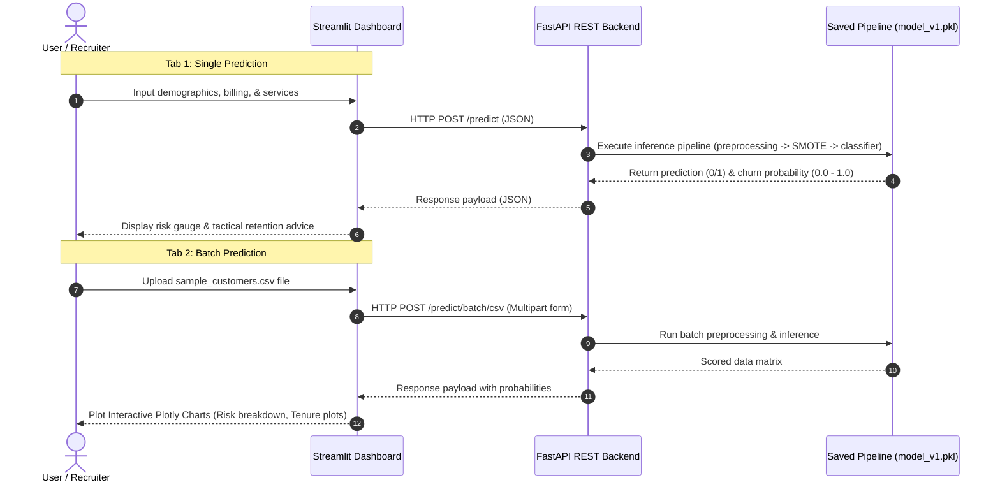

# 📊 Telco Customer Churn Prediction System

[](https://www.python.org/)
[](https://fastapi.tiangolo.com/)
[](https://streamlit.io/)
[](https://www.docker.com/)
[](https://github.com/)

A production-grade, end-to-end Machine Learning system predicting customer churn with rigorous class imbalance handling (SMOTE), full modeling pipelines, offline evaluation metrics, and a dual-execution dashboard.

---

## 🔗 Live Application Links
- **Interactive Streamlit Dashboard**: [Deploy on Streamlit Cloud](https://streamlit.io/cloud) *(See instructions below to link your repository)*
- **Production REST API Documentation (Swagger)**: [Deploy on Hugging Face Spaces](https://huggingface.co/spaces) *(See instructions below)*

---

## 🏗️ Architecture Design

This system implements a decoupled, modern architecture separating the backend prediction engine from the frontend client.



---

## ⚡ Key Features

1. **Separation of Concerns**: Separate, independent services for backend APIs (FastAPI) and frontend user interfaces (Streamlit).
2. **Robust Inference Preprocessing**: Real-time feature engineering (tenure grouping, TotalCharges casting, whitespace null value handling) applied identically to inference records.
3. **Class Imbalance Management**: Strict use of SMOTE over-sampling within an `imblearn.pipeline` to prevent data leakage during cross-validation.
4. **Interactive Dashboard**: Polished design using HSL colors, grid layouts, metric cards, Plotly charts, and sample CSV data exports.
5. **Swagger UI Doc Integration**: Interactive, fully-typed OpenAPI Swagger endpoints for developers.
6. **MLOps Ready**: Containerized with Docker and Docker Compose, linted and tested automatically with Github Actions CI, and backed by a comprehensive unit-test suite (`pytest`).

---

## 📂 Project Organization

```
customer-churn/
│
├── .github/workflows/
│   └── main.yml                  # CI/CD test action configuration
│
├── app/
│   ├── api.py                    # FastAPI prediction REST service
│   └── streamlit_app.py          # Dashboard web application
│
├── src/
│   ├── config.py                 # Central configurations & parameters
│   ├── preprocessing.py          # Data cleaning & preprocessing
│   ├── predict.py                # Prediction helper functions
│   ├── train.py                  # Model training and artifact output
│   └── utils.py                  # Serialization & logging utils
│
├── models/
│   ├── model_v1.pkl              # Serialized training pipeline
│   ├── metrics.json              # Saved evaluation numbers
│   ├── confusion_matrix.png      # Pre-generated Confusion Matrix plot
│   ├── roc_curve.png             # Pre-generated ROC plot
│   └── feature_importance.png    # Pre-generated Feature Importance plot
│
├── tests/
│   ├── test_preprocessing.py     # Preprocessing pipeline tests
│   ├── test_predict.py           # Prediction model tests
│   └── test_api.py               # REST API endpoints tests
│
├── Dockerfile.api                # Docker container for FastAPI
├── Dockerfile.streamlit          # Docker container for Streamlit
├── docker-compose.yml            # Multi-service local setup orchestration
├── sample_customers.csv          # Template CSV data for batch test
├── requirements.txt              # Project dependencies
└── README.md                     # Portfolio presentation
```

---

## 🚀 Local Installation & Execution

### 1. Setup Virtual Environment
Ensure your raw dataset file is located at `../WA_Fn-UseC_-Telco-Customer-Churn.csv`. Then, run:
```bash
# Create and activate environment
python -m venv .venv
source .venv/bin/activate  # On Windows: .venv\Scripts\activate

# Install dependencies
pip install -r requirements.txt fastapi uvicorn python-multipart pytest
```

### 2. Train Model Pipelines
Runs cross-validation across multiple algorithms (Logistic Regression, Random Forest, XGBoost), outputs the comparison table, saves the best model, and compiles evaluation metrics/plots:
```bash
python -m src.train
```

### 3. Run Unit Test Suite
Verify model functionality, data preprocessing, and API endpoints using pytest:
```bash
pytest
```

### 4. Start Local Servers
You can run locally with Python directly, or orchestrate using Docker.

#### Option A: Direct Local Execution (Multi-process)
```bash
# Terminal 1: Run the FastAPI backend service
uvicorn app.api:app --host 127.0.0.1 --port 8000 --reload

# Terminal 2: Run the Streamlit frontend client
streamlit run app/streamlit_app.py
```

#### Option B: Docker Compose (MLOps Containerization)
Ensure Docker Desktop is running, then run:
```bash
docker-compose up --build
```
- Access FastAPI documentation: http://localhost:8000/docs
- Access Streamlit Dashboard: http://localhost:8501

---

## 🔗 Swagger API Request Examples

### 1. Single Customer Inference (`POST /predict`)
```bash
curl -X 'POST' \
  'http://localhost:8000/predict' \
  -H 'accept: application/json' \
  -H 'Content-Type: application/json' \
  -d '{
  "gender": "Female",
  "SeniorCitizen": 0,
  "Partner": "Yes",
  "Dependents": "No",
  "tenure": 1,
  "PhoneService": "No",
  "MultipleLines": "No phone service",
  "InternetService": "DSL",
  "OnlineSecurity": "No",
  "OnlineBackup": "Yes",
  "DeviceProtection": "No",
  "TechSupport": "No",
  "StreamingTV": "No",
  "StreamingMovies": "No",
  "Contract": "Month-to-month",
  "PaperlessBilling": "Yes",
  "PaymentMethod": "Electronic check",
  "MonthlyCharges": 29.85,
  "TotalCharges": 29.85
}'
```

**Response Payload**:
```json
{
  "churn_probability": 0.5873,
  "prediction": 1,
  "risk_level": "Medium"
}
```

### 2. Batch Inference via CSV Upload (`POST /predict/batch/csv`)
Submit a raw CSV data table matching the feature structure:
```bash
curl -X 'POST' \
  'http://localhost:8000/predict/batch/csv' \
  -H 'accept: application/json' \
  -H 'Content-Type: multipart/form-data' \
  -F 'file=@sample_customers.csv;type=text/csv'
```

---

## 🛠️ Step-by-Step Deployment Instructions

### 1. Deploying Streamlit Dashboard (Streamlit Community Cloud)
Streamlit Cloud offers free hosting for public repositories:
1. Log in to [Streamlit Community Cloud](https://share.streamlit.io/).
2. Click **New app**, select your GitHub repository, specify branch `main` / `master`.
3. Set the **Main file path** to `app/streamlit_app.py`.
4. Click **Deploy!** Your app will be live on a custom `.streamlit.app` URL.

### 2. Deploying FastAPI Service (Hugging Face Spaces or Render)
For free API hosting using Docker containers:
#### Option A: Hugging Face Spaces (Docker Space)
1. Create a new Space on [Hugging Face Spaces](https://huggingface.co/new-space).
2. Set Space SDK to **Docker** (Blank template).
3. Push your repository files to the Space git remote.
4. Hugging Face will build the container using `Dockerfile.api` automatically and host it. Ensure your Dockerfile exposes port 7860 (Hugging Face default) or configure Space port.

#### Option B: Render Web Service
1. Log in to [Render](https://render.com/).
2. Create a new **Web Service** and connect your GitHub repository.
3. Select environment **Docker**, set the Dockerfile Path to `Dockerfile.api`.
4. Render will deploy the API. copy the live URL and insert it into the Streamlit dashboard configuration sidebar to link them!
