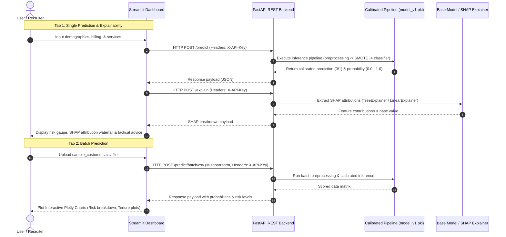

# 📊 Telco Customer Churn Prediction System

[](https://www.python.org/)
[](https://fastapi.tiangolo.com/)
[](https://streamlit.io/)
[](https://www.docker.com/)
[](https://optuna.org/)
[](https://shap.readthedocs.io/)
[](https://github.com/)

A production-grade, end-to-end Machine Learning system predicting customer churn with rigorous class imbalance handling (SMOTE), systematic Optuna hyperparameter optimization, probability calibration (Platt scaling), SHAP explainability, enterprise API authentication, and a dual-execution dashboard.

---

## 🔗 Live Application
<div align="center">

<a href="https://customer-churn-prediction-by-abhishek.streamlit.app/"></a>
&nbsp;
<a href="https://github.com/Abhishek01112002/customer-churn-prediction"></a>

</div>

---

## 🏛 Architecture Design

This system implements a decoupled, modern architecture separating the backend prediction engine from the frontend client, secured with API key authentication and CORS whitelisting.


```mermaid
sequenceDiagram
    autonumber
    actor Recruiter as User / Recruiter
    participant UI as Streamlit Dashboard
    participant API as FastAPI REST Backend
    participant Model as Calibrated Pipeline (model_v1.pkl)
    participant Base as Base Model / SHAP Explainer
    
    Note over Recruiter, UI: Tab 1: Single Prediction & Explainability
    Recruiter->>UI: Input demographics, billing, & services
    UI->>API: HTTP POST /predict (Headers: X-API-Key)
    API->>Model: Execute inference pipeline (preprocessing -> SMOTE -> classifier)
    Model-->>API: Return calibrated prediction (0/1) & probability (0.0 - 1.0)
    API-->>UI: Response payload (JSON)
    UI->>API: HTTP POST /explain (Headers: X-API-Key)
    API->>Base: Extract SHAP attributions (TreeExplainer / LinearExplainer)
    Base-->>API: Feature contributions & base value
    API-->>UI: SHAP breakdown payload
    UI-->>Recruiter: Display risk gauge, SHAP attribution waterfall & tactical advice
    
    Note over Recruiter, UI: Tab 2: Batch Prediction
    Recruiter->>UI: Upload sample_customers.csv file
    UI->>API: HTTP POST /predict/batch/csv (Multipart form, Headers: X-API-Key)
    API->>Model: Run batch preprocessing & calibrated inference
    Model-->>API: Scored data matrix
    API-->>UI: Response payload with probabilities & risk levels
    UI-->>Recruiter: Plot Interactive Plotly Charts (Risk breakdown, Tenure plots)
```

---

## 🌟 Key Features

1. **Systematic Hyperparameter Search (Optuna)**: Standalone tuning engine searching across XGBoost, Random Forest, and Logistic Regression with Stratified 5-Fold Cross-Validation, TPE sampling, and Median pruning to optimize the F1 score.
2. **Probability Calibration**: Best model wrapped in `CalibratedClassifierCV(method='sigmoid', cv=5)` (Platt scaling) so predicted probabilities reflect true empirical churn likelihood.
3. **SHAP Model Explainability**: Dedicated `POST /explain` endpoint integrating `shap.TreeExplainer` (for tree ensembles) and `shap.LinearExplainer` (for logistic regression) returning granular, per-feature attribution scores.
4. **Data Imputation Consistency**: Eliminates training-serving skew by computing and persisting the training set `TotalCharges` median to `models/totalcharges_median.pkl`, guaranteeing identical imputation at inference time.
5. **Enterprise API Security**: Protected inference endpoints require an `X-API-Key` header with `401 Unauthorized` and `403 Forbidden` response validation.
6. **Strict CORS Whitelisting**: Dynamic origin control via `ALLOWED_ORIGINS` environment variable, preventing unauthorized cross-origin requests.
7. **Class Imbalance Management**: Strict use of SMOTE over-sampling within `imblearn.pipeline` ensuring SMOTE is fitted only on training folds to prevent data leakage.
8. **Reproducible MLOps**: All dependencies pinned in `requirements.txt`, root and multi-stage Dockerfiles standardized on port 8000, and integrated with GitHub Actions CI.

---

## 📂 Project Organization

```
customer-churn/
│
├── .github/workflows/
│   └── main.yml                  # CI/CD test action configuration
│
├── app/
│   ├── api.py                    # FastAPI prediction & explainability REST service
│   └── streamlit_app.py          # Dashboard web application
│
├── src/
│   ├── config.py                 # Central configurations & parameters
│   ├── preprocessing.py          # Data cleaning, feature engineering & median persistence
│   ├── predict.py                # Inference pipelines, median loading & SHAP explainability
│   ├── train.py                  # Model training, calibration & artifact serialization
│   ├── tune.py                   # Optuna hyperparameter optimization engine
│   └── utils.py                  # Serialization & logging utils
│
├── models/
│   ├── model_v1.pkl              # Calibrated production inference pipeline
│   ├── base_model_v1.pkl         # Base pipeline for fast SHAP TreeExplainer
│   ├── totalcharges_median.pkl   # Persisted training median for TotalCharges
│   ├── best_params.json          # Best parameters found by Optuna
│   ├── metrics.json              # Saved evaluation numbers
│   ├── confusion_matrix.png      # Pre-generated Confusion Matrix plot
│   ├── roc_curve.png             # Pre-generated ROC plot
│   └── feature_importance.png    # Pre-generated Feature Importance plot
│
├── tests/
│   ├── test_preprocessing.py     # Preprocessing pipeline tests
│   ├── test_predict.py           # Prediction model tests
│   └── test_api.py               # REST API authentication & endpoint tests
│
├── Dockerfile                    # Root Dockerfile for standard build & Hugging Face Spaces
├── Dockerfile.api                # Docker container for FastAPI backend
├── Dockerfile.streamlit          # Docker container for Streamlit frontend
├── docker-compose.yml            # Multi-service local setup orchestration
├── sample_customers.csv          # Template CSV data for batch test
├── requirements.txt              # Pinned project dependencies
└── README.md                     # Portfolio presentation
```

---

## 💻 Local Installation & Execution

### 1. Setup Virtual Environment
Ensure your raw dataset file is located at `../WA_Fn-UseC_-Telco-Customer-Churn.csv`. Then run:

```bash
# Create and activate environment
python -m venv .venv
source .venv/bin/activate  # On Windows: .venv\Scripts\activate

# Install all pinned dependencies
pip install -r requirements.txt pytest
```

### 2. (Optional) Run Optuna Hyperparameter Tuning
Run the systematic hyperparameter search across model families:
```bash
python -m src.tune --trials 50
```
*Outputs `models/best_params.json` which is automatically loaded during training.*

### 3. Train & Calibrate Model Pipelines
Trains candidate models, applies the tuned hyperparameters, fits probability calibration via Platt scaling, generates plots, and serializes both the calibrated model and base SHAP model:
```bash
python -m src.train
```

### 4. Run Unit Test Suite
Verify model functionality, data preprocessing, API authentication, and explainability endpoints:
```bash
pytest -v
```

### 5. Start Local Servers

#### Option A: Direct Local Execution (Multi-process)
```bash
# Terminal 1: Run the FastAPI backend service (port 8000)
uvicorn app.api:app --host 127.0.0.1 --port 8000 --reload

# Terminal 2: Run the Streamlit frontend client (port 8501)
streamlit run app/streamlit_app.py
```

#### Option B: Docker Compose (MLOps Containerization)
Ensure Docker Desktop is running, then run:
```bash
docker compose up --build
```
- **FastAPI Swagger Docs**: [http://localhost:8000/docs](http://localhost:8000/docs)
- **Streamlit Dashboard**: [http://localhost:8501](http://localhost:8501)

*Environment variables can be configured in `.env` or `docker-compose.yml`:*
- `PORT=8000`: Backend server port.
- `API_KEY=changeme`: Secret API key for authentication.
- `ALLOWED_ORIGINS=http://localhost:8501,http://churn_frontend:8501`: Whitelisted CORS origins.

---

## 📡 REST API Request Examples

### 1. Single Customer Prediction (`POST /predict`)
Requires `X-API-Key` header:

```bash
curl -X 'POST' \
  'http://localhost:8000/predict' \
  -H 'accept: application/json' \
  -H 'Content-Type: application/json' \
  -H 'X-API-Key: changeme' \
  -d '{
  "gender": "Female",
  "SeniorCitizen": 0,
  "Partner": "Yes",
  "Dependents": "No",
  "tenure": 1,
  "PhoneService": "No",
  "MultipleLines": "No phone service",
  "InternetService": "DSL",
  "OnlineSecurity": "No",
  "OnlineBackup": "Yes",
  "DeviceProtection": "No",
  "TechSupport": "No",
  "StreamingTV": "No",
  "StreamingMovies": "No",
  "Contract": "Month-to-month",
  "PaperlessBilling": "Yes",
  "PaymentMethod": "Electronic check",
  "MonthlyCharges": 29.85,
  "TotalCharges": 29.85
}'
```

**Response Payload**:
```json
{
  "churn_probability": 0.5873,
  "prediction": 1,
  "risk_level": "Medium"
}
```

### 2. SHAP Model Explainability (`POST /explain`)
Returns calibrated predictions alongside per-feature SHAP attributions:

```bash
curl -X 'POST' \
  'http://localhost:8000/explain' \
  -H 'accept: application/json' \
  -H 'Content-Type: application/json' \
  -H 'X-API-Key: changeme' \
  -d '{
  "gender": "Female",
  "SeniorCitizen": 0,
  "Partner": "Yes",
  "Dependents": "No",
  "tenure": 1,
  "PhoneService": "No",
  "MultipleLines": "No phone service",
  "InternetService": "DSL",
  "OnlineSecurity": "No",
  "OnlineBackup": "Yes",
  "DeviceProtection": "No",
  "TechSupport": "No",
  "StreamingTV": "No",
  "StreamingMovies": "No",
  "Contract": "Month-to-month",
  "PaperlessBilling": "Yes",
  "PaymentMethod": "Electronic check",
  "MonthlyCharges": 29.85,
  "TotalCharges": 29.85
}'
```

**Response Payload**:
```json
{
  "churn_probability": 0.5873,
  "prediction": 1,
  "risk_level": "Medium",
  "shap_values": {
    "Contract_Two year": -0.312450,
    "tenure": -0.281140,
    "MonthlyCharges": 0.194200,
    "InternetService_Fiber optic": 0.145620,
    "PaymentMethod_Electronic check": 0.118930
  },
  "base_value": -1.243512,
  "prediction_score": 0.354188
}
```

### 3. Batch Inference via CSV Upload (`POST /predict/batch/csv`)
Submit a raw CSV data table matching the feature structure:
```bash
curl -X 'POST' \
  'http://localhost:8000/predict/batch/csv' \
  -H 'accept: application/json' \
  -H 'Content-Type: multipart/form-data' \
  -H 'X-API-Key: changeme' \
  -F 'file=@sample_customers.csv;type=text/csv'
```

---

## 🚀 Deployment Instructions

### 1. Deploying Streamlit Dashboard (Streamlit Community Cloud)
1. Log in to [Streamlit Community Cloud](https://share.streamlit.io/).
2. Click **New app**, select your GitHub repository, specify branch `main`.
3. Set the **Main file path** to `app/streamlit_app.py`.
4. Click **Deploy!** Your app will be live on a custom `.streamlit.app` URL.

### 2. Deploying FastAPI Service (Hugging Face Spaces)
The repository is pre-configured with Hugging Face Spaces Docker frontmatter:
1. Create a new Space on [Hugging Face Spaces](https://huggingface.co/new-space).
2. Set Space SDK to **Docker** (Blank template).
3. Connect your repository or push directly to the Space git remote:
   ```bash
   git remote add hf https://huggingface.co/spaces/<USERNAME>/customer-churn-api
   git push hf main
   ```
4. Hugging Face builds from `Dockerfile` automatically and routes traffic to port `8000` via `app_port: 8000`.
